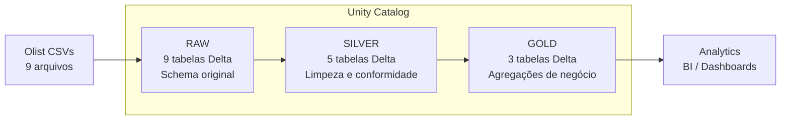

# Medallion E-Commerce Pipeline


Pipeline de dados completo com arquitetura **Medallion (Raw → Silver → Gold)** construído no Databricks Community Edition, usando dados reais de e-commerce brasileiro (Olist/Kaggle).

---

## Objetivo

Demonstrar na prática a implementação de uma arquitetura Medallion moderna com:
- Ingestão e governança de dados com **Unity Catalog**
- Transformações incrementais com **PySpark** e **Delta Lake**
- Camada analítica com agregações de negócio reais
- Rastreabilidade completa via **Data Lineage**

---

## Arquitetura



---

## Stack

| Tecnologia | Uso |
|---|---|
| Databricks Community | Ambiente de execução |
| PySpark | Transformações distribuídas |
| Delta Lake | Formato de armazenamento |
| Unity Catalog | Governança e lineage |
| Python 3.10+ | Linguagem principal |

---

## Estrutura do projeto

```
medallion-ecommerce-pipeline/
├── notebooks/
│   ├── 00_setup.ipynb               # Configuração inicial
│   ├── 01_raw_ingestion.ipynb       # Camada Raw
│   ├── 02_silver_transform.ipynb    # Camada Silver
│   └── 03_gold_aggregations.ipynb   # Camada Gold
├── src/
│   └── utils.py                     # Funções utilitárias
├── tests/
│   └── test_transformations.py      # Testes unitários
├── docs/
│   └── architecture.png             # Diagrama de arquitetura
└── README.md
```

---

## Camadas do pipeline

### Raw — Ingestão
- Leitura dos 9 CSVs do dataset Olist via PySpark
- Salvamento como Delta Tables sem transformações
- Adição de colunas de rastreabilidade: `_ingested_at`, `_source_file`
- Registro no Unity Catalog com comentários de coluna

**Tabelas:** `olist_orders_dataset`, `olist_customers_dataset`, `olist_order_items_dataset`, `olist_order_payments_dataset`, `olist_order_reviews_dataset`, `olist_products_dataset`, `olist_sellers_dataset`, `olist_geolocation_dataset`, `product_category_name_translation`

### Silver — Limpeza e Conformidade
- Remoção de duplicatas e nulos
- Conversão de datas para `TimestampType`
- Conversão de valores monetários para `DoubleType`
- Uso de `try_cast` para dados sujos
- Rastreabilidade completa por registro

**Tabelas:** `olist_orders`, `olist_customers`, `olist_payments`, `olist_reviews`, `olist_sellers`

### Gold — Agregações de Negócio
- **`orders_summary`** — Receita, ticket médio e NPS por estado e mês
- **`customer_ltv`** — LTV e ticket médio por estado
- **`delivery_performance`** — Prazo médio, atrasos e NPS por estado

---

## Governança

- 3 schemas isolados no Unity Catalog: `raw`, `silver`, `gold`
- `GRANT SELECT ON SCHEMA gold TO account users`
- Data Lineage automático rastreando origem de cada coluna
- Comentários em todas as tabelas e colunas principais

---

## Como rodar

### Pré-requisitos
- Conta no [Databricks Community Edition](https://community.cloud.databricks.com)
- Dataset [Brazilian E-Commerce (Olist)](https://www.kaggle.com/datasets/olistbr/brazilian-ecommerce) no Kaggle

### Passo a passo

1. Faça o upload dos 9 CSVs em `Volumes/workspace/raw/landing/`
2. Execute os notebooks na ordem:
   - `01_raw_ingestion`
   - `02_silver_transform`
   - `03_gold_aggregations`

---

## Resultados

| Camada | Tabelas | Total de linhas |
|---|---|---|
| Raw | 9 | ~1.5M |
| Silver | 5 | ~500k |
| Gold | 3 | ~600 |

---

## Autor

**Vinicius Trindade da Silva**
Analytics Engineer | Data Engineering

[](https://linkedin.com/in/viniitrindadee)
[](https://github.com/ViniiTrindadee)
